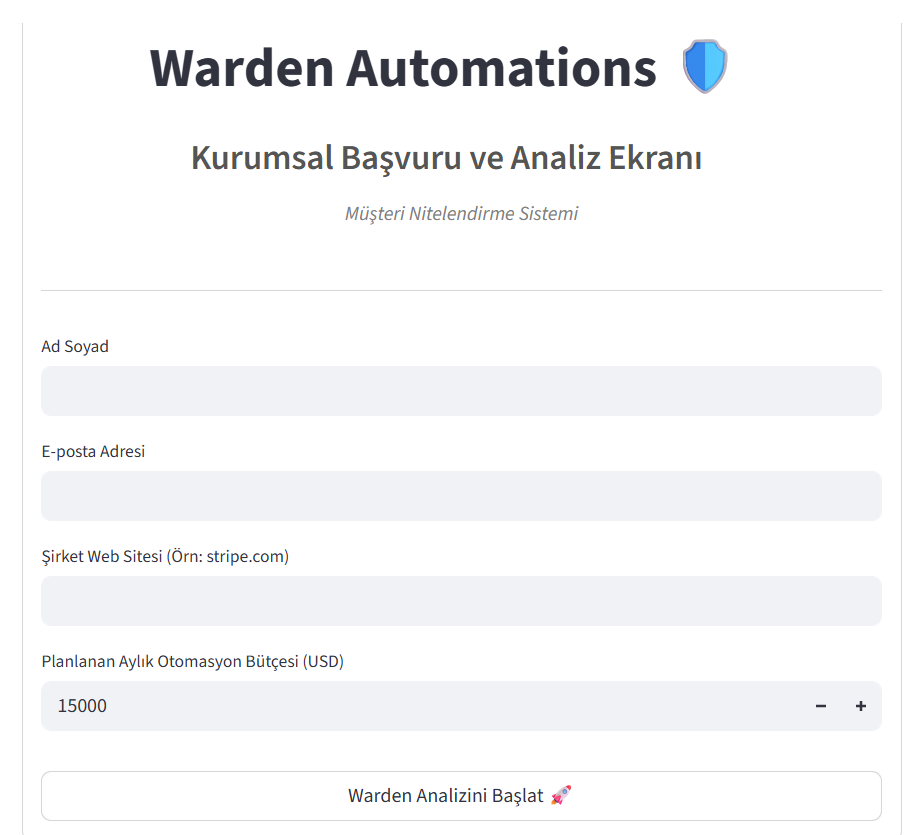

# 🧠 Warden B2B | SaaS Lead Nitelendirme Platformu

> **Warden Automations - AI Engine**

Warden B2B, B2B işletmelerine gelen potansiyel müşteri (lead) verilerini saniyeler içinde analiz eden, bütçe/zaman çizelgelerine göre skorlayan ve satış ekibine aksiyon öneren tam özellikli bir SaaS platformudur.

## 📸 Demo


## ⚡ Özellikler (Features)

### Temel Özellikler
- **Kullanıcı Kayıt/Giriş Sistemi:** JWT tabanlı güvenli authentication
- **Lead Yönetimi:** Lead oluşturma, listeleme ve detay görüntüleme
- **AI Analiz Entegrasyonu:** n8n webhook ile OpenAI GPT-4 entegrasyonu
- **Dashboard:** Gerçek zamanlı istatistikler ve lead geçmişi
- **Subscription Tier'ları:** Free (10 lead), Pro (100 lead), Enterprise (Unlimited)

### Gelişmiş Özellikler
- **Admin Paneli:** Tüm kullanıcıları ve lead'leri görüntüleme, yönetme
- **Password Reset:** Email tabanlı şifre sıfırlama
- **User Profile:** Profil düzenleme ve şifre değiştirme
- **CSV Export:** Lead verilerini CSV olarak indirme
- **API Rate Limiting:** Güvenlik için rate limiting
- **CORS Support:** Cross-origin resource sharing

## 🔄 Nasıl Çalışır? (The Pipeline)

1. **Kullanıcı Kayıt:** Kullanıcı kayıt olur, varsayılan Free tier atanır
2. **Lead Oluşturma:** Kullanıcı yeni lead ekler, veri backend'e kaydedilir
3. **AI Analiz:** Lead verisi n8n webhook'a gönderilir, OpenAI ile analiz edilir
4. **Skor Güncelleme:** Analiz sonuçları (skor, sentiment, aksiyon) backend'e kaydedilir
5. **Dashboard:** Kullanıcı dashboard'da lead'leri ve skorları görüntüler

## 🛠️ Tech Stack

- **Backend:** FastAPI + SQLAlchemy
- **Frontend:** Streamlit
- **Database:** SQLite (development) / PostgreSQL (production)
- **Authentication:** JWT + pbkdf2_sha256
- **Workflow Automation:** n8n
- **AI Engine:** OpenAI GPT-4
- **Security:** SlowAPI (rate limiting), CORS middleware
- **Deployment:** Docker + Docker Compose

## ⚙️ Kurulum (Local Setup)

### Gereksinimler
- Python 3.11+
- pip

### Adımlar

1. Repoyu klonlayın:
```bash
git clone https://github.com/e7555222-tech/wardenb2b
cd wardenb2b
```

2. Dependencies yükleyin:
```bash
pip install -r requirements.txt
```

3. Ortam değişkenlerini ayarlayın:
```bash
cp .env.example .env
```

4. Backend'i başlatın:
```bash
cd backend
uvicorn main:app --reload --host 0.0.0.0 --port 8000
```

5. Frontend'i başlatın (yeni terminal, repo kökünden):
```bash
streamlit run app.py
```

6. Tarayıcıda açın:
- Frontend: http://localhost:8501
- Backend API: http://localhost:8000
- API Docs: http://localhost:8000/docs

## 🐳 Docker Deployment

```bash
cp .env.example .env
# .env içinde N8N_WEBHOOK_URL, SECRET_KEY, WEBHOOK_SECRET doldurun
docker compose up -d --build
```

| Servis | URL |
|--------|-----|
| Backend API | http://localhost:8000 |
| Streamlit UI | http://localhost:8501 |
| PostgreSQL | localhost:5432 |

Durdurmak için: `docker compose down`

## 🔑 Environment Variables

| Variable | Açıklama |
|----------|----------|
| `API_URL` | Streamlit → FastAPI (Docker: `http://backend:8000`) |
| `N8N_WEBHOOK_URL` | Lead analiz webhook (Streamlit) |
| `DATABASE_URL` | SQLite veya PostgreSQL bağlantısı |
| `SECRET_KEY` | JWT imzalama anahtarı |
| `WEBHOOK_SECRET` | n8n → `/webhook/lead-score` header doğrulama (`X-Webhook-Secret`) |
| `OPENAI_API_KEY` | n8n / OpenAI (opsiyonel, n8n tarafında) |

### n8n skor geri çağrısı

Analiz sonrası n8n'den şu endpoint'e **JSON POST** gönderin:

`POST http://localhost:8000/webhook/lead-score`

Header: `X-Webhook-Secret: <WEBHOOK_SECRET>`

Body:
```json
{
  "lead_id": 1,
  "score": 85,
  "sentiment": "Yüksek",
  "action": "Hemen aranmalı"
}
```

## 📊 API Endpoint'leri

### Authentication
- `POST /register` - Kullanıcı kayıt
- `POST /token` - Login (JWT token)
- `GET /users/me` - Mevcut kullanıcı bilgisi

### Leads
- `POST /leads` - Lead oluştur
- `GET /leads` - Lead listesi
- `GET /leads/{id}` - Lead detay
- `PUT /leads/{id}/score` - Skor güncelle

### Admin
- `GET /admin/users` - Tüm kullanıcılar
- `GET /admin/leads` - Tüm lead'ler
- `PUT /admin/users/{id}/make-admin` - Admin yap
- `DELETE /admin/users/{id}` - Kullanıcı sil

### Password Reset
- `POST /password-reset/request` - Reset talebi
- `POST /password-reset/confirm` - Reset onay

### Webhook
- `POST /webhook/lead-score` - n8n webhook (skor güncelleme)

## 🔐 Güvenlik

- **Password Hashing:** pbkdf2_sha256
- **JWT Authentication:** 30 dakika token süresi
- **Rate Limiting:** 5 istek/dakika (register endpoint)
- **CORS:** Production'da spesifik domain'ler kullanılmalı
- **SQL Injection Protection:** SQLAlchemy ORM

## 📝 Subscription Tier'ları

| Tier | Lead Limit | Fiyat |
|------|------------|-------|
| Free | 10 lead | Ücretsiz |
| Pro | 100 lead | $29/ay |
| Enterprise | Unlimited | $99/ay |

> ⚠️ Payment entegrasyonu (Stripe) henüz tamamlanmadı.

## 🚀 Deployment

### Production Deployment için:
1. PostgreSQL kullanın (SQLite production için önerilmez)
2. Güçlü SECRET_KEY kullanın
3. HTTPS kullanın
4. CORS origin'leri kısıtlayın
5. Environment variables'ı güvenli şekilde yönetin
6. Monitoring/logging ekleyin

## 📄 Lisans

MIT License

## 🤝 Katkıda Bulunma

Pull request'ler kabul edilir!

## 📧 İletişim

Sorularınız için: [e7555222-tech](https://github.com/e7555222-tech)
