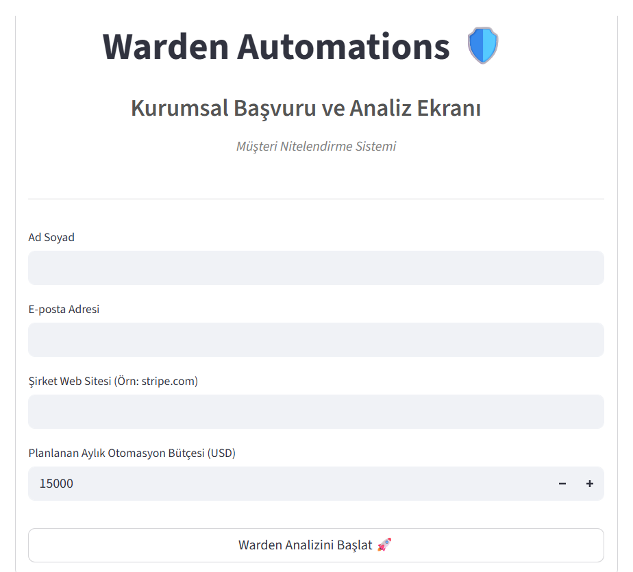

# 🛡️ Warden B2B — AI-Powered Lead Scoring SaaS

<p align="center">
  
</p>

<p align="center">
  
  
  
  
  
  
</p>

> B2B satış ekiplerine yönelik yapay zeka destekli lead nitelendirme platformu.  
> Potansiyel müşteri verilerini saniyeler içinde analiz eder, skorlar ve aksiyonları önerir.

---

## 🔑 Demo Erişim Bilgileri

Uygulamayı hemen test etmek için:

| Rol | E-posta | Şifre |
|-----|---------|-------|
| **Admin** | `admin@warden.demo` | `WardenAdmin2024!` |
| **Demo Kullanıcı** | `demo@warden.app` | `Demo1234!` |

> Demo kullanıcısı hesabında 5 adet önceden skorlanmış örnek lead bulunmaktadır.

---

## ⚡ Hızlı Başlangıç (Docker ile 1 Komut)

```bash
git clone https://github.com/e7555222-tech/wardenb2b
cd wardenb2b
docker compose up -d --build
```

Birkaç dakika içinde her şey hazır:

| Servis | URL |
|--------|-----|
| 🖥️ Uygulama (Streamlit) | http://localhost:8501 |
| ⚙️ Backend API | http://localhost:8000 |
| 📖 API Dokümantasyonu | http://localhost:8000/docs |
| 🗄️ PostgreSQL | localhost:5432 |

**Durdurmak için:** `docker compose down`  
**Veritabanı dahil temizlemek için:** `docker compose down -v`

---

## 🏗️ Mimari

```
┌─────────────────────────────────────────────────────────┐
│                      Kullanıcı (Tarayıcı)               │
└───────────────────────┬─────────────────────────────────┘
                        │ :8501
            ┌───────────▼────────────┐
            │   Streamlit Frontend   │
            │  app.py + pages/       │
            └───────────┬────────────┘
                        │ REST API (:8000)
            ┌───────────▼────────────┐
            │    FastAPI Backend     │
            │  JWT Auth · Rate Limit │
            │  Lead CRUD · Webhook   │
            └──────┬─────────┬───────┘
                   │         │
        ┌──────────▼──┐   ┌──▼────────────────┐
        │  PostgreSQL │   │    n8n Webhook     │
        │  (SQLite    │   │  + OpenAI GPT-4   │
        │  geliştirme)│   │  (opsiyonel)      │
        └─────────────┘   └───────────────────┘
```

---

## 🚀 Özellikler

### Kullanıcı Yönetimi
- JWT tabanlı kayıt ve giriş (4 saatlik oturum)
- Email + şifre değiştirme
- Profil düzenleme

### Lead Yönetimi
- Lead oluşturma formu (şirket, bütçe, web sitesi)
- AI analiz entegrasyonu (n8n → OpenAI GPT-4)
- **AI Simülasyon** — n8n olmadan tek tık lead skorlama (demo modu)
- Gerçek zamanlı skor güncellemesi (webhook)
- Dashboard: metrikler + isim/şirket/email arama + min. skor filtresi
- **Grafikler**: skor bar chart + sentiment donut chart (Altair)
- CSV export

### Subscription Sistemi
| Tier | Lead Limiti | Açıklama |
|------|------------|----------|
| 🆓 Free | 10 | Ücretsiz başlangıç |
| 💎 Pro | 100 | Büyüyen ekipler için |
| 🏢 Enterprise | Sınırsız | Kurumsal kullanım |

### Admin Paneli
- Tüm kullanıcıları ve lead'leri görüntüleme
- Kullanıcıya admin yetkisi verme
- **Kullanıcı planını yükseltme** (Free → Pro → Enterprise)
- Kullanıcı silme
- Ortalama skor ve nitelik istatistikleri

### Güvenlik
- `pbkdf2_sha256` şifre hash'leme
- 30 dakika JWT token süresi
- SlowAPI rate limiting (5 istek/dakika — register)
- CORS middleware
- SQLAlchemy ORM (SQL injection koruması)
- Webhook secret doğrulama

---

## ⚙️ Yerel Geliştirme (Docker'sız)

```bash
git clone https://github.com/e7555222-tech/wardenb2b
cd wardenb2b
pip install -r requirements.txt
cp .env.example .env
# .env içindeki değerleri düzenleyin
```

**Backend:**
```bash
cd backend
uvicorn main:app --reload --host 0.0.0.0 --port 8000
```

**Frontend (yeni terminal, repo kökünden):**
```bash
streamlit run app.py
```

---

## 🔧 Ortam Değişkenleri

| Değişken | Açıklama | Örnek |
|----------|----------|-------|
| `API_URL` | Frontend → Backend URL | `http://localhost:8000` |
| `N8N_WEBHOOK_URL` | Lead analiz webhook adresi | `https://n8n.io/webhook/...` |
| `DATABASE_URL` | Veritabanı bağlantısı | `sqlite:///./warden.db` |
| `SECRET_KEY` | JWT imzalama anahtarı | Rastgele uzun string |
| `WEBHOOK_SECRET` | n8n callback doğrulama | Rastgele string |
| `ADMIN_EMAIL` | Otomatik oluşturulacak admin e-postası | `admin@example.com` |
| `ADMIN_PASSWORD` | Admin şifresi | `GüçlüŞifre123!` |
| `DEMO_SEED` | Demo veri oluşturulsun mu? | `true` / `false` |

---

## 🔄 AI Analiz Akışı (n8n + OpenAI)

```
1. Kullanıcı lead oluşturur
2. Frontend, n8n webhook'una veri gönderir
3. n8n, OpenAI GPT-4 ile lead'i analiz eder
4. n8n, sonuçları backend webhook'una POST eder:

POST /webhook/lead-score
Header: X-Webhook-Secret: <WEBHOOK_SECRET>
Body: {
  "lead_id": 1,
  "score": 85,
  "sentiment": "Yüksek",
  "action": "Hemen aranmalı"
}

5. Dashboard güncellenir
```

---

## 📋 API Endpoint'leri

| Method | Endpoint | Açıklama | Auth |
|--------|----------|----------|------|
| `POST` | `/register` | Kayıt | — |
| `POST` | `/token` | Giriş (JWT) | — |
| `GET` | `/users/me` | Profil | ✅ |
| `PUT` | `/users/me` | Profil güncelle | ✅ |
| `POST` | `/users/me/change-password` | Şifre değiştir | ✅ |
| `POST` | `/leads` | Lead oluştur | ✅ |
| `GET` | `/leads` | Lead listesi | ✅ |
| `GET` | `/leads/{id}` | Lead detay | ✅ |
| `GET` | `/subscription` | Abonelik bilgisi | ✅ |
| `POST` | `/webhook/lead-score` | AI skor güncelle | Secret |
| `GET` | `/admin/users` | Tüm kullanıcılar | 👑 Admin |
| `GET` | `/admin/leads` | Tüm lead'ler | 👑 Admin |
| `PUT` | `/admin/users/{id}/make-admin` | Admin yap | 👑 Admin |
| `DELETE` | `/admin/users/{id}` | Kullanıcı sil | 👑 Admin |
| `GET` | `/health` | Sağlık kontrolü | — |

> Tam interaktif dokümantasyon: http://localhost:8000/docs

---

## ☁️ Cloud Deployment

### Render (Ücretsiz)

```bash
# Repo'yu Render'a bağlayın ve render.yaml otomatik okunur
# https://render.com/deploy
```

1. [render.com](https://render.com) → **New Blueprint**
2. Bu repo'yu bağlayın → `render.yaml` otomatik algılanır
3. Deploy tamamlandıktan sonra `warden-frontend` servisindeki  
   `API_URL` değişkenini `warden-backend` URL'si ile güncelleyin

### Railway

```bash
railway up
```

`railway.toml`:
```toml
[build]
builder = "nixpacks"

[deploy]
startCommand = "cd backend && uvicorn main:app --host 0.0.0.0 --port $PORT"
```

---

## 🛠️ Tech Stack

| Katman | Teknoloji |
|--------|-----------|
| Frontend | Streamlit 1.32+ · Altair 5+ |
| Backend | FastAPI 0.110+ |
| ORM | SQLAlchemy 2.0 |
| Veritabanı | SQLite (dev) · PostgreSQL 15 (prod) |
| Auth | JWT (python-jose) · passlib pbkdf2_sha256 |
| Rate Limiting | SlowAPI |
| AI | OpenAI GPT-4 via n8n · Built-in simülatör |
| CI | GitHub Actions (Ruff lint + Docker validate) |
| Deployment | Docker · Docker Compose · Render |

---

## 📄 Lisans

MIT © [e7555222-tech](https://github.com/e7555222-tech)
